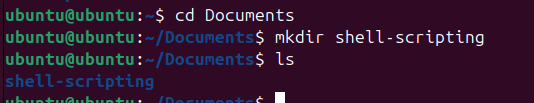
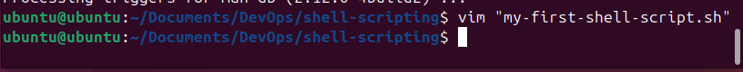
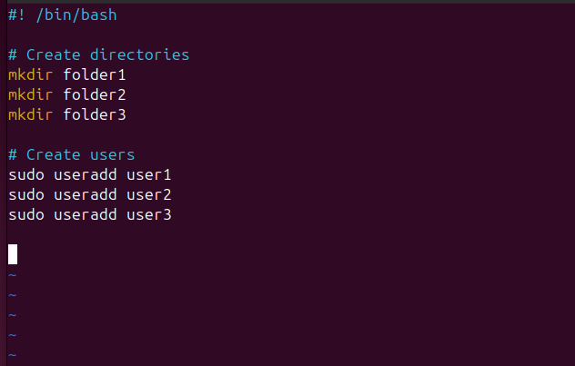
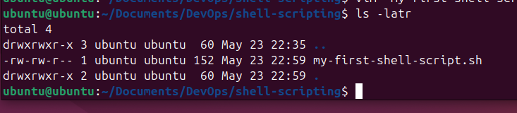
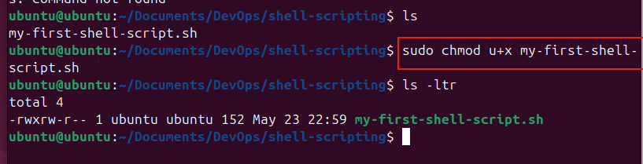
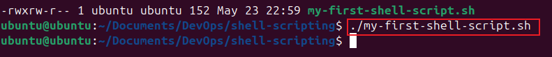
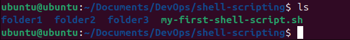
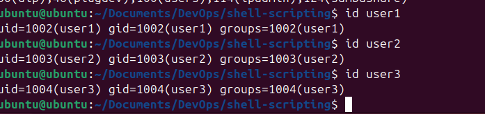
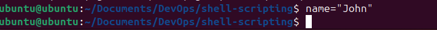

# Shell-scripting-mini
Shell scripting is the process of writing a series of commands in a file (called a script) to be executed by a Unix/Linux shell like bash, sh, or zsh.

It’s a way to automate tasks using the terminal.

### Tasks

1. I created a folder on my ubuntu server using the mkdir command and named it shell-scripting

2. Using the vim editor, I created a file named my-first-shell-script.sh

3. Pressing 'i' on the keyboard I entered the insert mode of the vim editor and typed in the following code: 

\#!/bin/bash  
\# Create directories  
mkdir Folder1  
mkdir Folder2  
mkdir Folder3  
\# Create users  
sudo useradd user1  
sudo useradd user2  
sudo useradd user3

4. I saved the sh file.

Using the ls command, I confirmed the file was created.

5. I used the chomd command to give the file owner the execute permission.

6. I executed the script file using the command: ./my-first-shell-script.sh

7. I used the ls command to confirm tha the three folders: folder1, folder2, folder3 were created according to the script.

8. I also used the id command to confirm that the three users: user1, user2, user3 were created.

## Variables

A variable is a named storage location in a or script that holds data you can use and change.

In scripting, variables store values like numbers, text, or more complex data.

They help make code flexible and reusable.

You assign a value to a variable, then refer to the variable by name later.

### Tasks

1. I created a variable called 'name' and assigned it the value 'John'.

2. I used the echo command to retrieve the value of the variable, this printed the value 'John' on the terminal.

